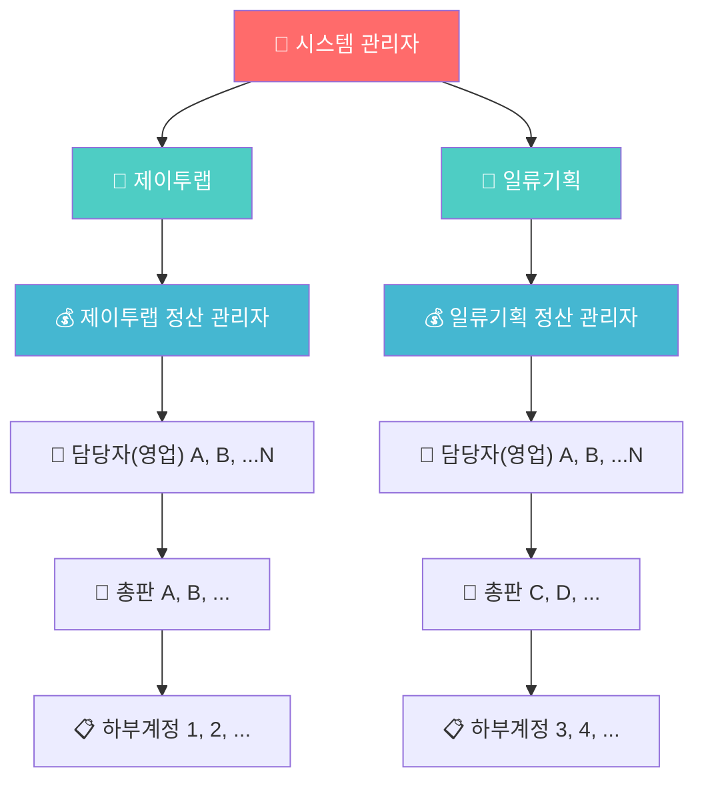
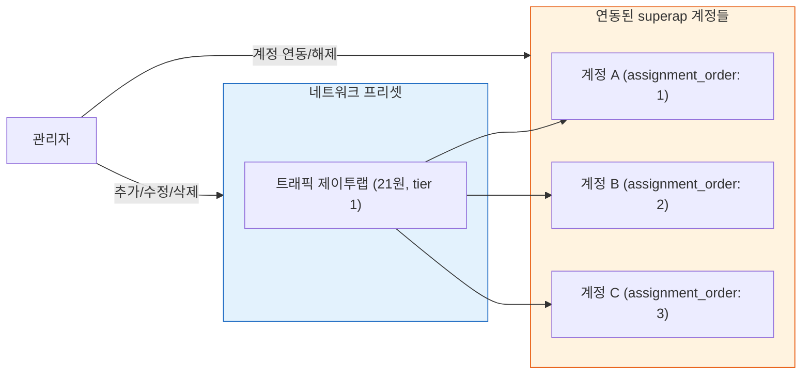
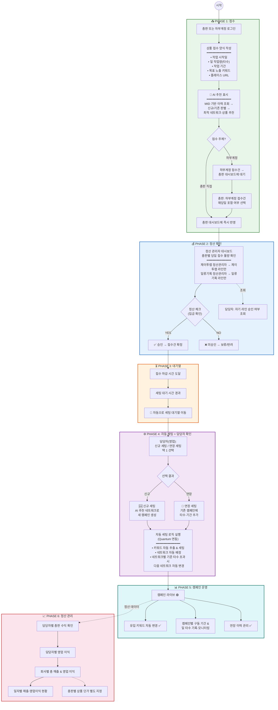
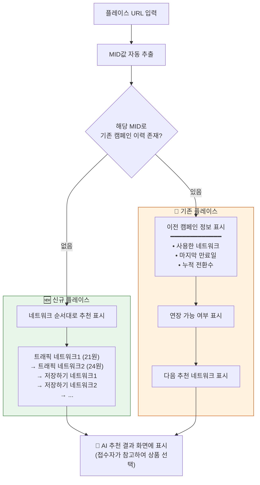
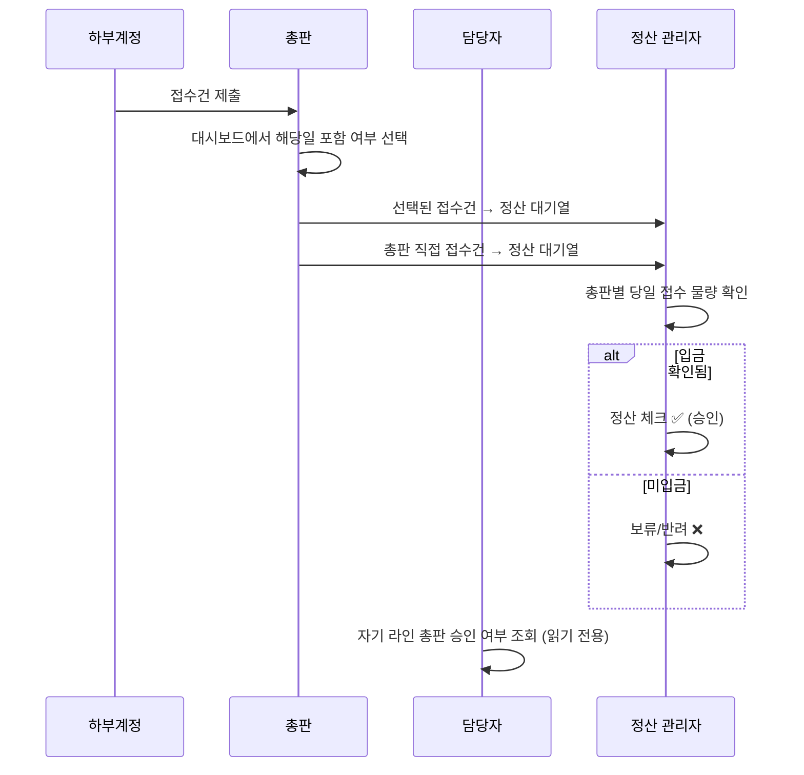
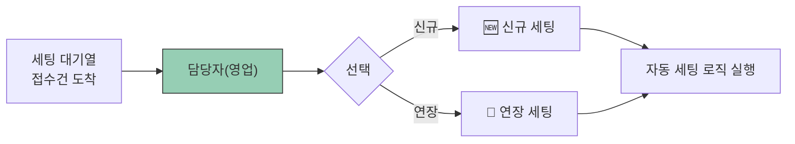
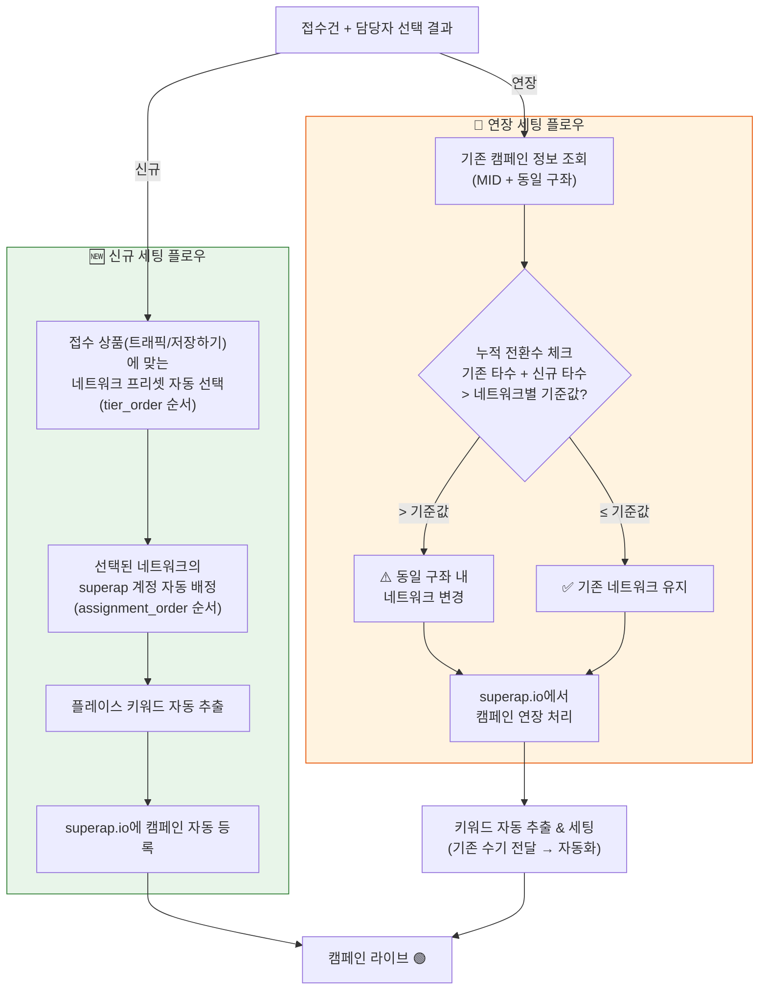
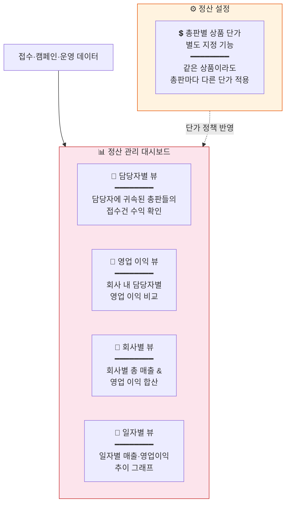
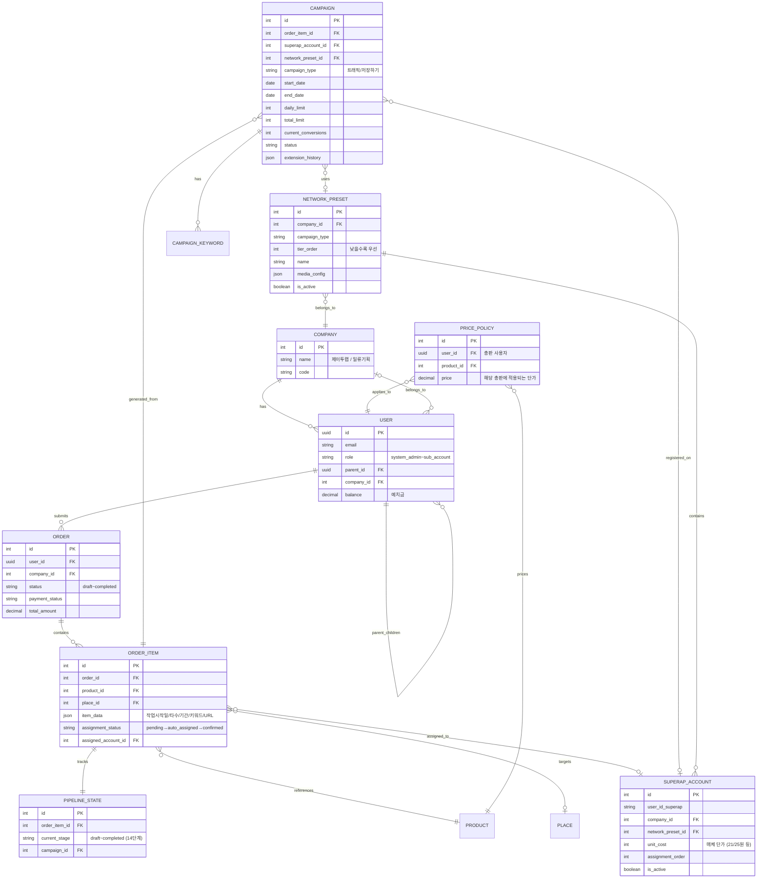
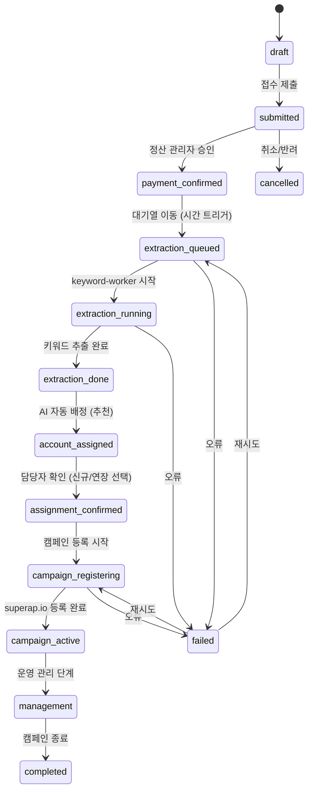

# 일류 리워드 플랫폼 — 워크플로우 설계 문서 (Claude Code 구현 가이드)

> **문서 목적**: Claude Code에 전달하여 구현 방향성을 잡기 위한 전체 워크플로우 명세서
> **작성일**: 2026-03-02
> **버전**: v2.0
> **운영 회사**: 제이투랩, 일류기획
> **연동 시스템**: Quantum Campaign Automation (superap.io)

---

## 1. 시스템 개요

일류 리워드 플랫폼은 네이버 플레이스 리워드 캠페인의 **접수 → 정산 확인 → 자동 세팅 → 캠페인 운영 → 정산 관리**를 하나의 시스템에서 처리하는 통합 플랫폼이다.

상품은 **트래픽**과 **저장하기** 두 가지이며, 이 상품들을 superap.io(퀀텀)에 세팅하여 운영한다.

---

## 2. 계정 체계 (6단계 계층)



### 계정별 권한

| 계정 등급 | 접수 | 하부계정 접수건 선택 | 정산 체크 | 승인여부 조회 | 대시보드 | 정산 관리 | 네트워크 관리 |
|-----------|:----:|:-------------------:|:---------:|:-------------:|:--------:|:---------:|:------------:|
| 시스템 관리자 | - | - | - | ✅ | ✅ 전체 | ✅ 전체 | ✅ |
| 정산 관리자 | - | - | ✅ | ✅ | ✅ 자사 | ✅ 자사 | - |
| 담당자(영업) | - | - | ❌ | ✅ 자기라인 | ✅ 자기라인 | ✅ 자기라인 | - |
| 총판 | ✅ | ✅ | ❌ | ❌ | ✅ 자기건 | ❌ | - |
| 하부계정 | ✅ | ❌ | ❌ | ❌ | ❌ | ❌ | - |

**핵심 규칙:**
- 하부계정은 **접수만** 가능. 정산 프로세스 없음, 대시보드 없음.
- 총판은 대시보드에서 하부계정 접수건을 **해당일 접수에 포함시킬지 선택** 가능.
- 정산 체크 버튼은 **각 회사의 정산 관리자(메인 계정)만** 누를 수 있음.
- 담당자는 자기 라인의 총판 접수건 승인 여부를 **조회만** 가능.

---

## 3. 네트워크 구조

### 개념

네트워크는 superap.io에서 캠페인을 세팅하는 **계정 그룹** 단위이다. 각 회사별로 지정된 세팅 계정들이 있고, 계정마다 매체 단가가 다르다. 매체 단가가 높을수록 더 많은 앱/서버를 사용할 수 있고 상위 노출 확률이 높아진다.

### 네트워크 프리셋 예시

| 네트워크명 | 회사 | 상품 | 매체 단가 | tier_order |
|-----------|------|------|----------|:----------:|
| 트래픽 제이투랩 | 제이투랩 | 트래픽 | 21원 | 1 |
| 트래픽 제이투랩24 | 제이투랩 | 트래픽 | 25원 | 2 |
| 저장 제이투랩 | 제이투랩 | 저장하기 | 별도 | 1 |
| 트래픽 일류기획 | 일류기획 | 트래픽 | 21원 | 1 |
| 트래픽 일류기획24 | 일류기획 | 트래픽 | 25원 | 2 |
| 저장 일류기획24 | 일류기획 | 저장하기 | 별도 | 1 |

### 동적 관리 (필수)

네트워크 프리셋은 **언제든 추가/수정/삭제가 가능**해야 한다. 새로운 단가 버전의 계정이 나올 수 있기 때문이다.



네트워크 프리셋 관리에서 할 수 있는 것:
- 새 네트워크 프리셋 생성 (이름, 회사, 상품 타입, 단가, 순서 지정)
- 기존 프리셋 정보 수정 (단가 변경, 순서 변경, 활성/비활성)
- 프리셋에 superap 계정 연동/해제
- 프리셋 삭제 (연결된 캠페인이 없는 경우)

---

## 4. 메인 워크플로우 (End-to-End)



---

## 5. PHASE 1 상세: 접수 + AI 추천

### 접수 양식 입력 필드

| 필드 | 타입 | 필수 | 설명 |
|------|------|:----:|------|
| 플레이스 URL | URL | ✅ | 네이버 플레이스 URL (MID값 자동 추출) |
| 작업 시작일 | Date | ✅ | 캠페인 시작 날짜 |
| 일 작업량 | Integer | ✅ | 하루 타수 (일일 전환 목표) |
| 작업 기간 | Integer | ✅ | 작업 일수 |
| 목표 노출 키워드 | Text | ✅ | 원하는 노출 키워드 |

### AI 추천 로직

총판/하부계정이 플레이스 URL을 입력하는 시점에 시스템이 즉시 분석하여 추천을 표시한다.



**AI 추천은 참고용이다.** 접수자(총판/하부계정)는 추천을 보고 트래픽 또는 저장하기를 선택하여 접수하면 된다. 최종 세팅 결정은 담당자가 한다.

---

## 6. PHASE 2 상세: 정산 확인

### 정산 관리자 대시보드 흐름



**회사별 분리:** 제이투랩 정산 관리자는 제이투랩 라인의 총판만 보이고, 일류기획 정산 관리자는 일류기획 라인만 보인다. 교차 조회 불가.

---

## 7. PHASE 3 상세: 대기열 → 자동 이동

정산 체크(승인)된 접수건은 바로 세팅으로 넘어가지 않는다.

1. 해당 상품의 **접수 마감 시간**이 도달해야 함
2. 마감 후 **세팅 대기 시간**이 경과해야 함
3. 두 조건 충족 시 **자동으로** 세팅 대기열로 이동

이 과정은 시간 기반 자동 트리거이며, 수동 개입이 필요 없다.

---

## 8. PHASE 4 상세: 담당자 확인 + 자동 세팅

### 담당자(영업)의 역할

세팅 대기열에 올라온 접수건을 보고, 담당자는 **단 두 가지만 선택**하면 된다.



- **신규 세팅**: AI가 추천한 네트워크/계정으로 새 캠페인을 생성
- **연장 세팅**: 기존 캠페인에 타수·기간을 추가하여 연장

담당자는 네트워크 배정이나 계정 선택 같은 복잡한 결정을 할 필요 없다. 시스템이 알아서 처리한다.

### 자동 세팅 로직 (Quantum 연동, 구현 완료)

담당자가 선택한 후 실행되는 자동 세팅 로직의 상세 흐름:



### 자동 연장 조건 (의사코드)

```
# 연장 세팅 시 자동 판단 로직
IF 담당자가 "연장 세팅" 선택:
    기존캠페인 = DB조회(동일 MID + 동일 구좌 + 만료일 차이 ≤ 6일)

    IF 기존캠페인.누적타수 + 신규타수 > 기존캠페인.네트워크기준타수:
        → 동일 구좌 내 다음 네트워크로 변경하여 세팅
    ELSE:
        → 기존 네트워크 유지하고 타수·기간 연장

# 신규 세팅 시 네트워크 선택 로직
IF 담당자가 "신규 세팅" 선택:
    네트워크목록 = 해당 회사 + 해당 상품타입의 네트워크 프리셋 (tier_order ASC)
    사용이력 = 해당 MID로 이미 사용한 네트워크 목록
    선택네트워크 = 네트워크목록에서 사용이력에 없는 첫 번째
    계정 = 선택네트워크에 연동된 계정 (assignment_order ASC, 활성 캠페인 수 최소)
```

---

## 9. PHASE 5 상세: 캠페인 운영

| 기능 | 상태 | 설명 |
|------|:----:|------|
| 유입 키워드 자동 변경 | ✅ 구현 완료 | APScheduler로 주기적 키워드 로테이션 |
| 연장 이력 관리 | ✅ 구현 완료 | JSON 배열로 연장 회차별 기록 |
| 캠페인 구동 기간 & 일 타수 기록 | 🔧 보완 필요 | 현재 연장 기록만 있음 → 전체 기간 표시 추가 |
| 키워드 자동 추출 & 세팅 | 🆕 신규 | 기존 수기 전달 → 접수 시 자동 추출로 전환 |

---

## 10. PHASE 6 상세: 정산 관리

### 대시보드 뷰 구성



### 정산 계산 로직

```
# 매출 (총판에게 청구하는 금액)
매출 = Σ(접수건별 일_타수 × 작업_기간 × 해당_총판_상품_단가)

# 원가 (superap.io에 지불하는 금액)
원가 = Σ(접수건별 일_타수 × 작업_기간 × 네트워크_매체_단가)
  └ 매체_단가: 네트워크별 상이 (21원, 25원 등)

# 영업이익
영업이익 = 매출 - 원가

# 총판별 단가 커스텀
총판_A_트래픽_단가 = 기본값 존재, 총판별 오버라이드 가능
```

---

## 11. 데이터 모델 (핵심 엔티티 관계)



---

## 12. 파이프라인 상태 머신

하나의 접수건(OrderItem)이 거치는 전체 라이프사이클:



---

## 13. 구현 현황 & TODO 요약

| 기능 | 상태 | 비고 |
|------|:----:|------|
| 자동 세팅 로직 (Quantum) | ✅ | 캠페인 등록, 연장, 네트워크 변경 |
| 유입 키워드 자동 변경 | ✅ | APScheduler 키워드 로테이션 |
| 캠페인 연장 이력 관리 | ✅ | JSON 배열 기록 |
| 계정 자동 배정 (assignment) | ✅ | auto_assign → confirm/override |
| 네트워크 프리셋 CRUD | ✅ | 동적 추가/수정/삭제 |
| 파이프라인 상태 추적 | ✅ | 14단계 상태 머신 |
| 접수 시 AI 추천 표시 | 🆕 | MID 기반 이력 조회 → 추천 UI |
| 담당자 신규/연장 선택 UI | 🆕 | 기존 confirm/override 대신 단순화 |
| 총판 → 하부계정 접수건 선택 | 🆕 | 총판 대시보드 기능 |
| 키워드 자동 추출 & 세팅 | 🆕 | 수기 전달 → 자동화 |
| 캠페인 구동 기간 & 일 타수 기록 | 🔧 | 연장 기록만 → 전체 기간 표시 |
| 접수 마감 → 대기열 자동 이동 | 🆕 | 시간 기반 자동 트리거 |
| 정산 관리 대시보드 | 🆕 | 담당자/회사/일자별 뷰 |
| 총판별 상품 단가 지정 | 🆕 | 커스텀 가격 정책 |
| 정산 프로세스 (회사별 분리) | 🔧 | 정산관리자 전용 체크 기능 |

---

## 14. 핵심 비즈니스 룰 요약

1. **하부계정은 접수만 가능.** 정산 프로세스 없음, 대시보드 없음.
2. **총판이 하부계정 접수건 선택.** 대시보드에서 해당일 포함 여부를 골라야 정산 대기열에 올라감.
3. **정산 체크는 정산 관리자만.** 담당자는 자기 라인의 승인 여부 조회만 가능.
4. **회사별 정산 분리.** 제이투랩 정산관리자 ↔ 일류기획 정산관리자 교차 조회 불가.
5. **접수 시 AI 추천.** MID 기반으로 신규/기존 판별, 네트워크 추천은 tier_order 순.
6. **담당자는 신규/연장만 선택.** 네트워크·계정 배정은 시스템이 자동 처리.
7. **자동 연장 조건.** 동일 MID + 동일 구좌 + 만료↔시작 차이 ≤ 6일.
8. **네트워크 변경 트리거.** 연장 시 누적 전환수 > 해당 네트워크 기준 타수이면 동일 구좌 내 다음 네트워크로 이동.
9. **키워드 자동 추출.** 기존 수기 전달 → 접수 시 자동 추출로 전환.
10. **네트워크 동적 관리.** 프리셋은 언제든 추가/수정/삭제 가능. 새 단가 계정 나오면 새 네트워크로 연동.
11. **총판별 단가 커스텀.** 같은 상품이라도 총판마다 다른 단가 적용 가능.
12. **마감 후 자동 큐잉.** 접수 마감 시간 + 세팅 대기 시간 경과 시 자동으로 세팅 대기열 이동.
